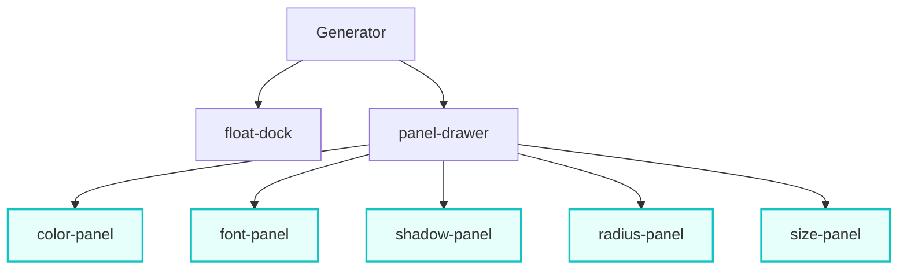
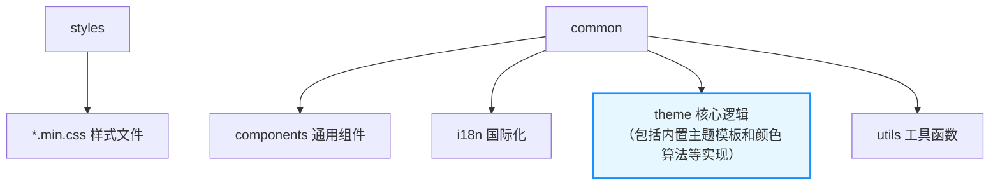

# CONTRIBUTING

**如果你想要新增特性或修复 Bug，建议阅读本文档，以便更好地理解代码的实现**

## 📁 目录结构

项目 UI 层由一个浮动入口 `dock` 和一个包含多个功能面板的侧边 `panel` 组成：

项目还包含两个文件夹：

`*.min.css` 文件来自 `tdesign-vue` 且经过二次压缩

- 额外添加了 `:host` 选择器，确保 Web Components 打包后样式正常
- 移除颜色相关的 token，使主题生成器能与外部主题色直接同步

## 🧚 交互逻辑

### 数据持久化

1. `custom-theme-options`：

| Key                           | 类型                       | 示例                  |
| ----------------------------- | -------------------------- | --------------------- |
| `theme`                       | 主题                       | `TCloud`              |
| `color`                       | 主题色                     | `#45C58B`             |
| `gray/success/warning/danger` | 功能色的品牌色             | `#2ba471`             |
| `font/radius/shadow`          | 预设步骤中的位置           | `1`                   |
| `line-height`                 | 固定或递增模式及其参数 | `plus_9` / `time_1.5` |
| `recommend`                   | 智能推荐                   | `true`                |
| `neutral`                     | 关联主题色                 | `true`                |

2. `custom-theme-tokens`：各种 `--td-*` token，主要来自用户手动修改单个变量的操作

### 执行流程

1. **初始化**：根据本地存储的 `theme`（或默认主题），进行 CSS 模板挂载

2. **配置恢复**：读取本地存储的 `tokens`，并还原用户的自定义修改

3. **面板渲染**：各个 Panel 根据 `options` 确定初始化数值

## 😈 开发规范

1. **常量管理**：使用 `UPPER_CASE` 命名方式，独立存放在 JS 文件中，与 Vue 逻辑分离

2. **全局状态管理**：避免通过 props 层层传递共享变量，优先使用 `inject`、`mixin` 或 `store` 等

3. **动态编码管理**：避免硬编码数值，特别是 Token 相关的映射，优先从 CSS 中获取配置
